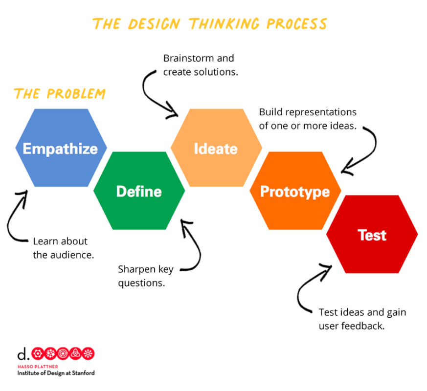

# Principle of being Professional

---

# Shopee Logistic Performance Data

---

# Instruction

You are provided with the "Shopee Code League 2020 Data Science" dataset. Your task is to explore and analyze this data using Looker Studio.

- [Looker Studio Data Source](https://lookerstudio.google.com/datasources/2268e52a-ce2d-4ee8-8e50-eacb9bdf2c91)
- [Raw Data](https://www.kaggle.com/datasets/davydev/shopee-code-league-20)

---

# Data

| Column Name | Description                                                                                             |
| :---------- | :------------------------------------------------------------------------------------------------------ |
| order_id    | Unique identifier for each delivery order                                                               |
| carriers    | Name or ID of the logistics company (carrier) responsible for the delivery (e.g., Carrier_2, Carrier_5) |
| pickup      | Date the order was picked up by the carrier                                                             |
| 1st_attempt | Date of the first delivery attempt                                                                      |
| 2nd_attempt | Date of the second delivery attempt, if the first was unsuccessful (can be empty)                       |

---

# Data

| Column Name  | Description                                                                                  |
| :----------- | :------------------------------------------------------------------------------------------- |
| pickup_city  | City where the order was picked up                                                           |
| deliver_city | City where the order was delivered                                                           |
| route        | Delivery route, typically shown as "Origin-Destination" (e.g., Luzon-Manila, Manila-Visayas) |
| days_limit   | Promised maximum number of days to deliver (service level agreement)                         |

---

# Data

| Column Name      | Description                                                                                                               |
| :--------------- | :------------------------------------------------------------------------------------------------------------------------ |
| 1st_attempt_days | Number of days from pickup to the first delivery attempt                                                                  |
| 2nd_attempt_days | If applicable, number of days between first and second delivery attempts (empty if not needed)                            |
| status           | Delivery outcome (e.g., "on_time" if delivered within days_limit, or possibly other statuses like "late," "failed," etc.) |

---

# Instruction

- Your main objective is to design and build an interactive dashboard in Looker Studio that evaluates the performance of different delivery carriers.
- This should help stakeholders answer questions such as:
  - Which carriers are the most reliable?
  - How do shipping times compare between carriers?
  - Where do most delays or failed deliveries occur?
  - What are the trends in shipment volumes and delivery times over specific time periods?

---

# Instruction

> You will work in a team of 3-4 people.

---

# Design Thinking

---

> To get a good idea, you need a lots of ideas.

Linus Pauling
_(Two-time Nobel laureate)_

---

---

---

# Tools

- https://excalidraw.com/
